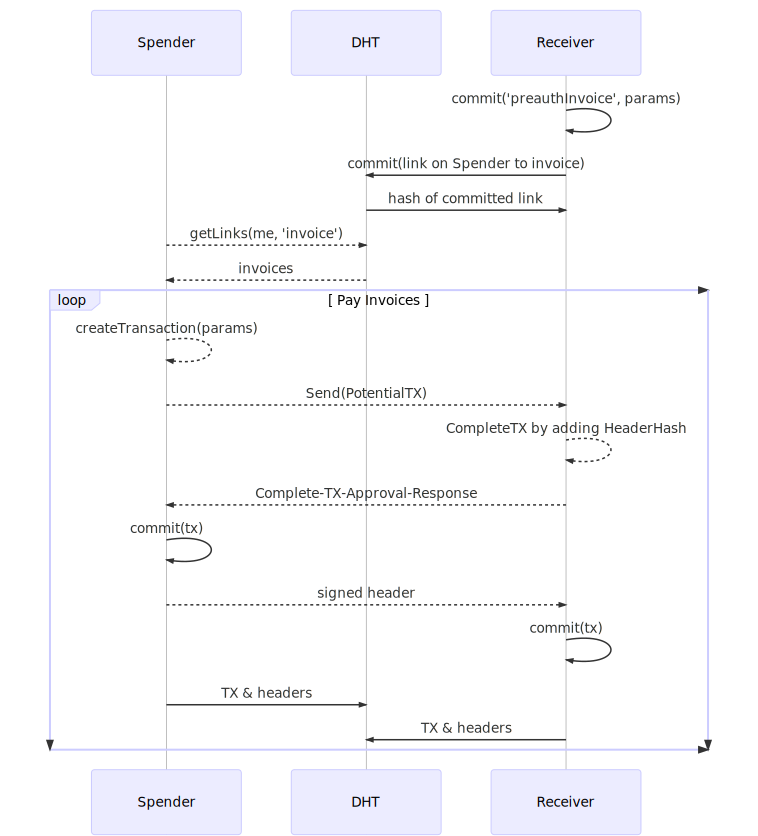

# Transactor

[](http://www.gnu.org/licenses/gpl-3.0)
[](https://gitter.im/metacurrency/holochain?utm_source=badge&utm_medium=badge&utm_campaign=pr-badge&utm_content=body_badge)

**Asset backed mutual-credit currency built on holochain**
Prototype of mutual-credit currency with reserve accounts and pre-authorization.
## Sequence Diagram



[Link to HackMD svg source](https://hackmd.io/MX1hgdusQbedFIX9s4PPSw)

## Installation

Prerequisite: [Install holochain](https://github.com/metacurrency/holochain/#installation) on your machine.
You can install transactor very simply with this:

``` shell
hcdev init -cloneExample=transactor

```

## Usage

To do a test run of transactor simply type

``` shell
cd transactor
hcdev web
```
you should see something like:

``` shell
Copying chain to: /home/bootstrap/.holochaindev
...
Serving holochain with DNA hash:QmZYxoxcqgCp6Xf6xVe8ptzPkmH8QMzxqp4r49QYpS2fEF on port:4141
```
Then simply point your browser to http://localhost:4141 access the UI.

### Tests
To run all the stand alone tests:

``` shell
hcdev test
```

## Contribute
We welcome pull requests and issue tickets.  Find us on [gitter](https://gitter.im/metacurrency/holochain) to chat.

Contributors to this project are expected to follow our [development protocols & practices](https://github.com/metacurrency/holochain/wiki/Development-Protocols).


## License
[](http://www.gnu.org/licenses/gpl-3.0)

Copyright (C) 2017, The MetaCurrency Project (Eric Harris-Braun, Arthur Brock, et. al.)

This program is free software: you can redistribute it and/or modify it under the terms of the license provided in the LICENSE file (GPLv3).  This program is distributed in the hope that it will be useful, but WITHOUT ANY WARRANTY; without even the implied warranty of MERCHANTABILITY or FITNESS FOR A PARTICULAR PURPOSE.

**Note:** We are considering other 'looser' licensing options (like MIT license) but at this stage are using GPL while we're getting the matter sorted out.
